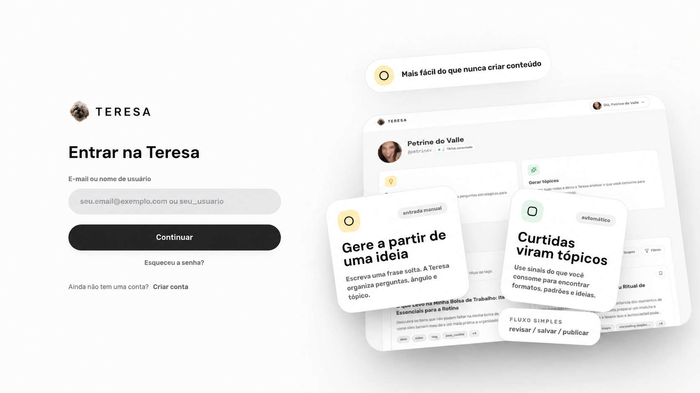
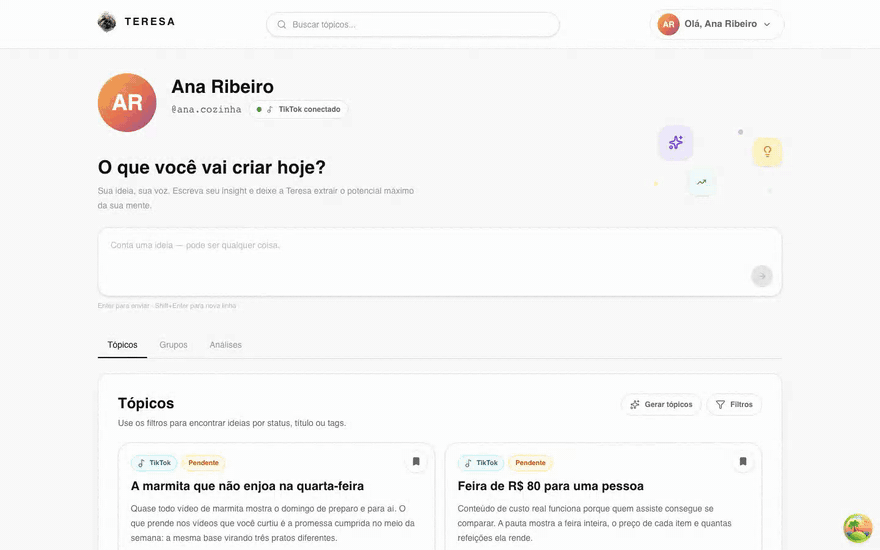
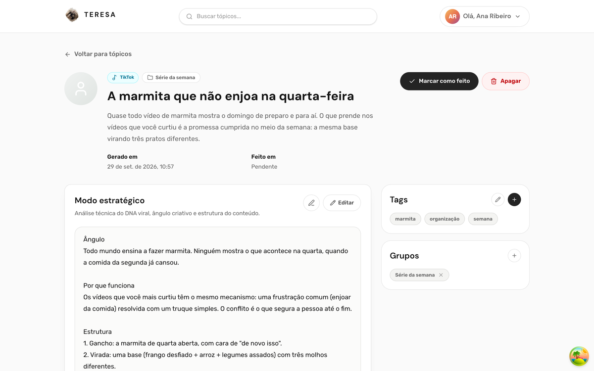
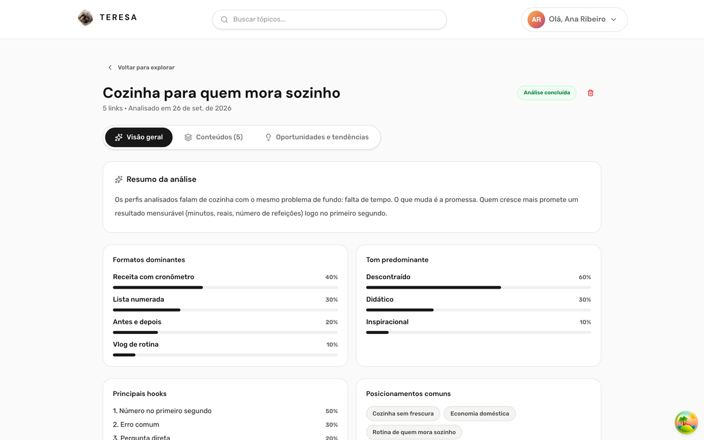
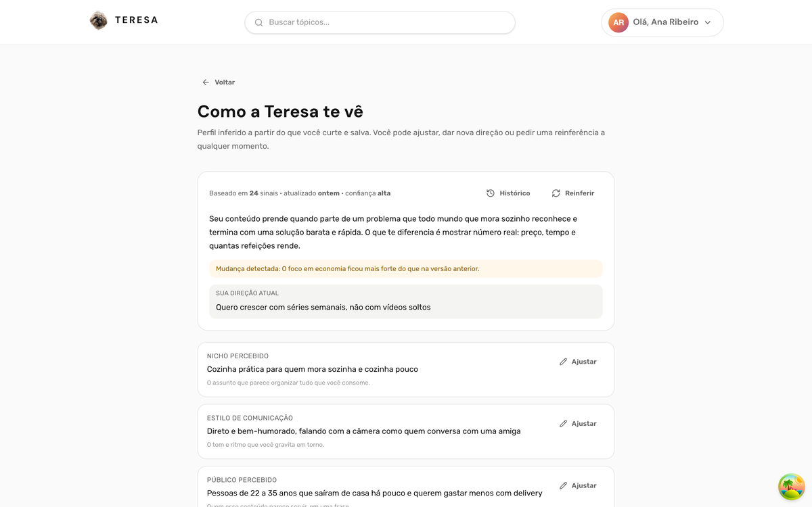
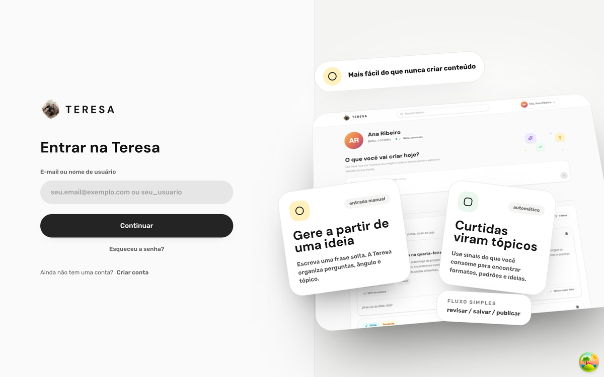
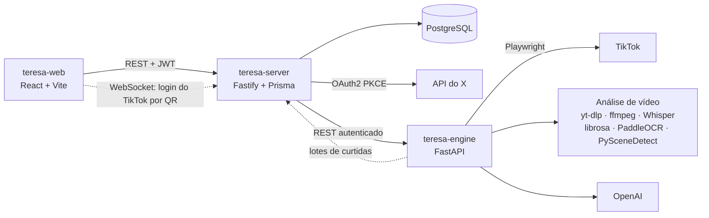

<h1 align="center">Teresa</h1>

<p align="center">
  <strong>Inteligência criativa para transformar repertório em conteúdo.</strong>
</p>

<p align="center">
  A Teresa entende o que prende a sua atenção e transforma ideias, referências e sinais das redes sociais em pautas e roteiros prontos para evoluir.
</p>

<p align="center">
  <a href="https://petrine.vercel.app" target="_blank" rel="noopener noreferrer">
    
  </a>
</p>

<a href="https://petrine.vercel.app" target="_blank" rel="noopener noreferrer">
  
</a>

## A ideia

A maioria de quem cria conteúdo não tem falta de ideia; tem falta de clareza sobre o que a diferencia. Ferramentas de pauta respondem “sobre o que falar”. A Teresa tenta responder “por que isso funciona com você”.

Ela parte do repertório que você já tem. Cada referência é analisada em diferentes camadas para separar o tema do mecanismo de retenção — o motivo pelo qual aquele conteúdo prende a atenção. As pautas nascem daí, e não apenas do que já viralizou.

<p align="center">
  
</p>

## O que dá para fazer

**Curtidas viram tópicos.** Com o TikTok ou o X conectado, a Teresa coleta novas referências, analisa e devolve pautas com título, resumo, tags e as inspirações que deram origem a cada uma.

**Dois roteiros por tópico.** O modo estratégico explica o ângulo, por que funciona e a estrutura. O modo pronto para gravar traz falas e cenas. Os dois podem ser editados ou refinados com uma nova instrução.

**Tenho uma ideia.** Uma frase solta vira tópico depois de algumas perguntas de aprofundamento.

**Explore.** Você nomeia um recorte do mercado, adiciona referências e recebe uma leitura sobre formatos, tons, hooks, posicionamentos, oportunidades e tendências.

**Direção de marca.** A Teresa mostra os traços que aparecem no seu repertório e cruza essa leitura com o lugar que você deseja ocupar. O resultado reúne forças, lacunas de percepção, primeiros movimentos e um caminho para os próximos meses.

**Fechando o loop.** Ao marcar um tópico como feito, você informa o link publicado e acompanha as métricas do conteúdo.

| Tópico | Explore | Direção de marca |
| :---: | :---: | :---: |
|  |  |  |

<p align="center">
  
</p>

As imagens usam uma conta de demonstração, com dados fictícios.

## Arquitetura



- **teresa-web** — esta interface. Não fala diretamente com o engine nem com as redes sociais;
- **teresa-server** — autenticação, conexões sociais, tópicos, Explore, direção de marca, persistência e tarefas em segundo plano;
- **teresa-engine** — automação do TikTok, análise multimodal e geração de texto.

Algumas decisões importantes:

- **Jobs no PostgreSQL.** Coleta diária, análises e sincronização de métricas usam tabelas de jobs no banco, sem uma fila externa;
- **Sessão do TikTok protegida.** Os cookies ficam criptografados e o login acontece por QR code em um navegador controlado pelo engine;
- **Sessões revogáveis.** O JWT aponta para uma sessão que pode ser encerrada nas configurações;
- **Cadastro por convite.** A criação de conta exige uma chave de convite válida.

## Stack da interface

- React 19, TypeScript e Vite;
- React Router 7;
- TanStack Query e Redux Toolkit;
- Tailwind CSS, Radix UI e Framer Motion;
- ESLint.

## Executando localmente

Requisitos: Node.js 22 ou superior e a API da Teresa disponível em outro processo.

```bash
npm install
cp .env.example .env
npm run dev
```

A interface ficará disponível em `http://localhost:5173`.

### Variável de ambiente

```env
VITE_API_URL=http://localhost:3333
```

## Verificações

```bash
npm run typecheck
npm run lint
npm run build
```

<p align="center">
  <a href="https://petrine.vercel.app" target="_blank" rel="noopener noreferrer"><strong>Acessar a aplicação →</strong></a>
</p>
