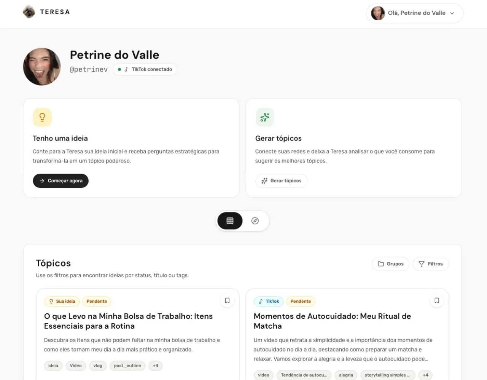

<h1 align="center">Teresa</h1>

<p align="center">
  <strong>Inteligência criativa para transformar repertório em conteúdo.</strong>
</p>

<p align="center">
  A Teresa organiza ideias, referências e sinais das redes sociais em tópicos e roteiros prontos para evoluir.
</p>

<p align="center">
  <a href="https://petrine.vercel.app" target="_blank" rel="noopener noreferrer">
    
  </a>
</p>

<a href="https://petrine.vercel.app" target="_blank" rel="noopener noreferrer">
  
</a>

## Sobre

A Teresa nasceu para reduzir a distância entre ter uma boa referência e saber o que fazer com ela. A aplicação ajuda criadores a partir de uma ideia, aproveitar o que já consomem nas redes e construir conteúdos com mais direção — sem engessar o processo criativo.

O fluxo reúne descoberta, organização e execução em um só lugar: a ideia vira tópico, o tópico ganha roteiro e o conteúdo publicado pode continuar sendo acompanhado.

## O que acontece na prática

- ideias soltas são desenvolvidas com perguntas e direcionamento;
- curtidas e referências podem se transformar em novos tópicos;
- links externos podem ser analisados para encontrar padrões e oportunidades;
- tópicos podem ser organizados por grupos, filtros e status;
- cada conteúdo pode evoluir para um roteiro antes da publicação;
- publicações concluídas podem receber métricas para acompanhar o resultado.

## Produto



## Construção

A interface foi desenvolvida com React, TypeScript e Vite. O estado compartilhado usa Redux Toolkit, os dados remotos são gerenciados com TanStack Query e as interações combinam Tailwind CSS, Radix UI e Framer Motion.

## Executando localmente

Requisitos: Node.js 22 ou superior e uma API da Teresa disponível.

```bash
npm install
cp .env.example .env
npm run dev
```

A aplicação ficará disponível em `http://localhost:5173`.

### Variável de ambiente

```env
VITE_API_URL=http://localhost:3333
```

## Verificações

```bash
npm run typecheck
npm run lint
npm run build
```

<p align="center">
  <a href="https://petrine.vercel.app" target="_blank" rel="noopener noreferrer"><strong>Acessar a aplicação →</strong></a>
</p>
